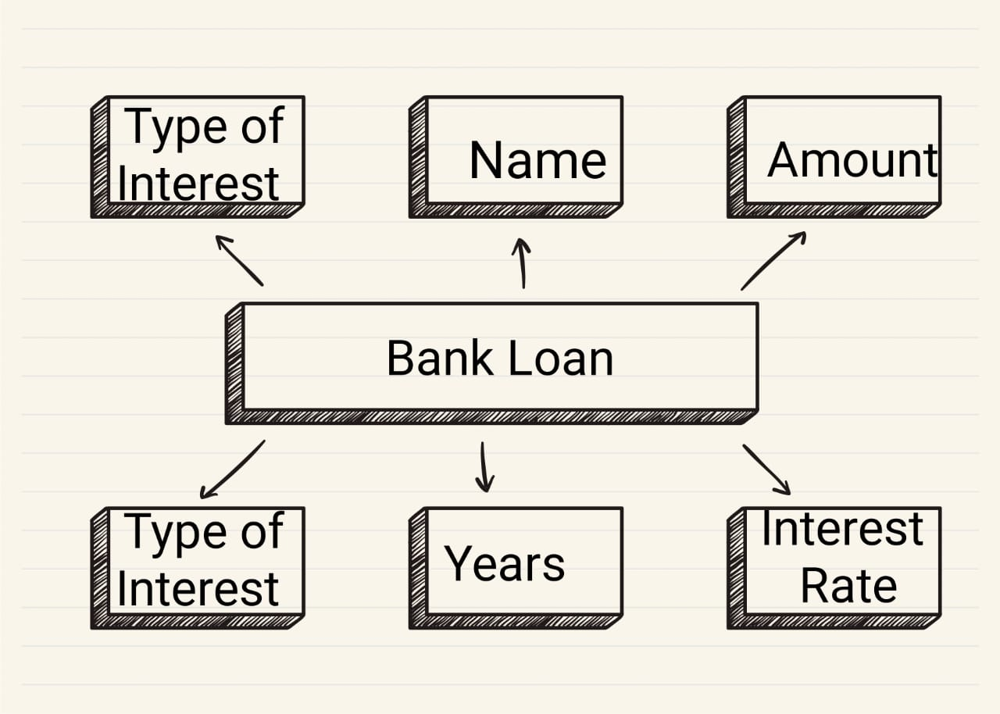

# Ex02 Django ORM Web Application
## Date: 28.10.24

## AIM
To develop a Django application to store and retrieve data from a bank loan database using Object Relational Mapping(ORM).

## ENTITY RELATIONSHIP DIAGRAM



## DESIGN STEPS

### STEP 1:
Clone the problem from GitHub

### STEP 2:
Create a new app in Django project

### STEP 3:
Enter the code for admin.py and models.py

### STEP 4:
Execute Django admin and create details for 10 books

## PROGRAM
```
models.py 

from Django.db import models
from Django.contrib import admin
class loan_customer(models.Model):
  lc=models.CharField(max_length=20,primary_key="lc")
  name=models.CharField(max_lengt=50)
  loan_amount=models.IntegerField()
  interest_rate=models.FloatField()
  numberofyears=models.FloatField()
  typeofinterest=models.CharField(max_length=20)
  typeofloan=models.CharField(max_length=20)


class loan_customerAdmin(admin.ModelAdmin):
  list_display=('loan_amount','name','interest_rate','numberofyears','typeofinterest','lc','typeofloan')


Admin.py

from django.contrib import admin
from .models import loan_customer,loan_customerAdmin
admin.site.register(loan_customer,loan_customerAdmin)
```


## OUTPUT

.png>)


## RESULT
Thus the program for creating a database using ORM hass been executed successfully
